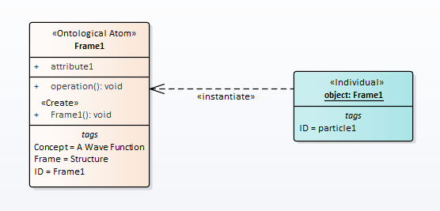
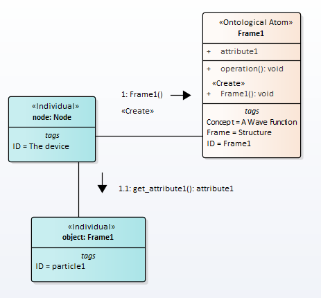

# Wave Function And Wave Function Collapse
A number of scientists have developed the idea that algorithms can be used to describe physical phenomena. In greatest detail this idea is described in books by Stefan Wolfram [1, 2]. In these books, using graphs (networks) as a basis for representing nature and then deriving the laws of physics from algorithms using the graphs has been proposed. A similar point of view is stated in G. Hooft's book [3].  
  
Our approach develops this idea further on the basis of an object-oriented paradigm. Instead of algorithms, we propose considering the exchange of messages between objects. Since objects are instances of classes, and links (communications) are instances of associations, the scientific model can be described as a frame semantic network, in particular it can be seen as an ontological description.  

The choice of concepts for models of quantum effects is based on one or another interpretation of quantum mechanics. At present, there are at least eleven interpretations of quantum mechanics. In this paper, we propose a description of quantum effects based on the concept of ''affordances'' [4]. This interpretation of quantum mechanics was first advanced by Werner Heisenberg and then developed by Vladimir A. Fock. According to this interpretation, quantum reality includes both objects in the classical sense and objects that exist only in the form of possibility or probability. This view is supported by both physicists and philosophers. A fairly detailed exposition of this interpretation is given in book [5].  

Following the tradition of programming languages such as the Smalltalk and  Python, we will treat both the classes themselves and class instances as objects. Class instances will be interpreted as objects of reality in the classical sense, and classes will be interpreted as objects that exist in possibility. Classes can also create new objects-class, so there won't be an endless chain of metaclasses.  
  
Wave function analog is a class, Fig.1.  This figure shows a frame named Frame1, which is rendered as a "Class" UML-element. The Frame1 is assigned the concept "Wave function". This concept has the designation ID (ID may not match Frame1). Wave function collapse analog is to run constructor of the class and create an object, i.e. instance of the class.  
However, it is more correct to say so. The wave function is a way of mathematically describing a class.   

  

Figure 1: Quantum and classical description of a point particle


We separate wave function collapse and measurement over a quantum system. In our opinion, the collapse of the wave function can occur in nature without any measurements.
The measurement procedure is shown in Fig.2  

  
Figure 2: The wavefunction collapse  


The measurement results upon collapse of the wave function can vary, but the outcome after collapse will remain the same. If we were to repeat the measurement, we would obtain the same value every time for the measured property.  

Is it possible to observe objects-class ?  
In our opinion, yes. Really.  
We observe objects-instance  because every classical object has at least three methods: set() for assigning a value to an attribute (impact), get() for getting an attribute value (measurement), and Run() for changing state over time.
Object-class must also have the same methods. But only now it will be the attributes and methods of the class. Their purpose is exactly the same. The Ran() class method is necessary for the wave function to obey the time-dependent Schrödinger equation.
Let us explain this with a well-known example. Let particles with spin 1/2 fall into the Stern-Gerlach device. In this case, we will have two streams of particles with a spin projection of +1/2 and -1/2. This situation is modeled by the set() message . If we put the second Stern-Gerlach device in the path of one of the beams, then only one detector (+1/2 or -1/2) will always work. This situation is modeled by the get() message. Here we ask the question "Does the particle have a spin of +1/2 (-1/2)?" And we get the answer in the form of Yes / No.  
Thus, for objects-class, the observation conditions are exactly the same as for objects-instance.  

In code, this can be done like this  
``` python
class Class1:

    # data attribute (class variable) common to all instances of the class
    attribute = None

    @classmethod
    def cRun(cls):
        pass
    @classmethod
    def cset(cls, v):
        cls.attribute = v
    @classmethod
    def cget(cls):
        return cls.attribute
    
    def __init__(self, name):
        # class instance variable is unique for each instance
        self.name = name
        print(self.name, self.attribute) 
    def set(self, name):
        self.name = name
    def get(self):
        return self.name
    def Run(cls):
        pass
    

Class1.cset(+1)
print(Class1.cget())
i = Class1('i')
j = Class1('j')
print(i.attribute,j.attribute )

```
Execution result  
``` 
===================== RESTART: 
1
i 1
j 1
1 1
```  

## References  
1. Wolfram S.: A New Kind of Science, free E-Book, 2002, 
Available from: https://www.wolframscience.com/nks/
2. Wolfram S.: A Class of Models with the Potential to Represent Fundamental Physics, arXiv:2004.08210, 2020, Available from: 
https://doi.org/10.48550/arXiv.2004.08210
3. Hooft G.: The Cellular Automaton Interpretation of Quantum Mechanics, arXiv:1405.1548, 2015, Available from: 
https://doi.org/10.48550/arXiv.1405.1548
4. Harre R.: Intern.Studies in the Phil. of Science, V.4,2,1990.
5. Sevalnikov A.Y.: Interpretations of quantum mechanics: In search of a new ontology. M.: Book house ''LIBROKOM'', 2009.
6. Feynman R, Leighton R, and Sands M. The Feynman Lectures on Physics, Volume 3: Quantum mechanics. NEW MILLENNIUM EDITION
7. Penrose R.: The Road to Reality: A Complete Guide to the Laws of the Universe, 	Jonathan Cape, 2004 %(Entangled P.582, EPR P.585)
8. D'Espagnat B. (1979): The Quantum Theory and Reality, Scientific American: 241 (5): 158–181, Available from: http://www.sciam.com/media/pdf/197911\_0158.pdf

