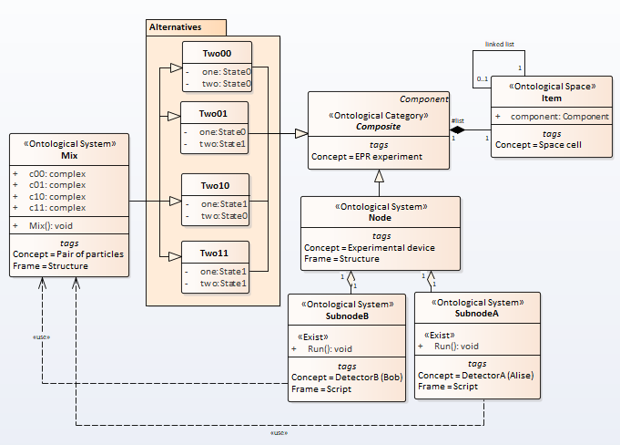
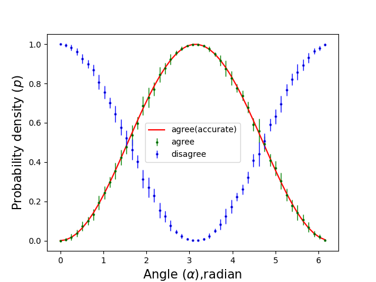

# Bell's test
## 1. Matematical discription

Consider an analogue of the Stern-Gerlach experiment. Stern-Gerlach devices $$P_1$$ and $$P_2$$ are located along the same axis and can rotate around this axis.
Orient the $$P_1$$ device along the $$Z$$ axis and leave it untouched. We will rotate the device $$P_2$$ around the $$X$$ axis at different angles $$\alpha$$. For each angle value, we obtain a series of EPR pairs and calculate the probabilities of different outcomes, as well as the probabilities $$P(match), P(diff)$$.

The formulas for these probabilities will look like

\begin{eqnarray}
	P(+,-)] = \frac{1}{2} \cos^2 (\frac{\alpha}{2}) \nonumber \\  
	P(-,+)] = \frac{1}{2} \cos^2 (\frac{\alpha}{2}) \nonumber \\  
	P(+,+)] = \frac{1}{2} \sin^2 (\frac{\alpha}{2})  \\  
	P(-,-)] = \frac{1}{2} \sin^2 (\frac{\alpha}{2}) \nonumber \\  
	P(math)] = \frac{1}{2} \sin^2 (\frac{\alpha}{2}) \nonumber \\  
	P(diff)] = \frac{1}{2} \cos^2 (\frac{\alpha}{2}) \nonumber  
\end{eqnarray}

Bell's inequality has the form

\begin{equation}
 \frac{N[A^+,B^+]}{N} \leq \frac{N[B^-,C^-]}{N} + \frac{N[A^+,C^+]}{N}
\end{equation},

here $$N[...]/N$$ is the frequency of the corresponding configuration. From the point of view of the theory of hidden variables, this inequality must be satisfied for any directions A, B, C.

From the point of view of quantum mechanics, we have

\begin{eqnarray}
	\frac{N[A^+,B^+]}{N} \approx P[A^+,B^+] = \frac{1}{18} \sin^2 (\frac{AB}{2}) \nonumber \\  
	\frac{N[B^-,C^-]}{N} \approx P[B^-,C^-] = \frac{1}{18} \sin^2 (\frac{BC}{2})  \\
	\frac{N[A^+,C^+]}{N} \approx P[A^+,C^+] = \frac{1}{18} \sin^2 (\frac{AC}{2}) \nonumber
\end{eqnarray}

and inequality 11 will be written

\begin{equation}
\sin^2 (\frac{AB}{2}) \leq \sin^2 (\frac{BC}{2}) + \sin^2 (\frac{AC}{2})
\end{equation}

There are such mutual orientations of the directions A, B, C for which this inequality does not hold.

## 2. Semantic Net Describtion
Bell's test as a semantic net is depicted in the picture Fig. 
Fig.7. The Bell's test model

The dependence of the probability density on the angle of rotation is shown in Fig. \ref{fig:fig8}

Fig.8. The probability density of the angle

The complete code is here [https://github.com/vgurianov/qm/software/bell.py](https://github.com/vgurianov/qm/blob/master/software/bell.py).

We will use the same model as in section 5, only now the angle will take three values AB = 240° BC = 60° AC = 300° randomly. The experiment measured the number of events and showed the inequality  
\begin{equation}
	N[A^+,B^+] \leq N[B^-,C^-] + N[A^+,C^+]
\end{equation}

Experiment result is depicted in table 2

| №   | $$AB$$   | $$BC$$  | $$AC$$   | $$N[A^+,B^+] < $$|$$N[B^-,C^-]+N[A^+,C^+]$$ |
| --- | ---- | --- | ---- | :----------: | :-----: |
| 1   | 240° | 60° | 300° | 15         | 11                    |
| 2   | 240° | 60° | 300° | 15         | 11                    |
