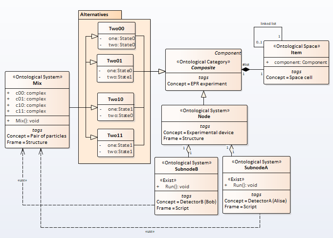
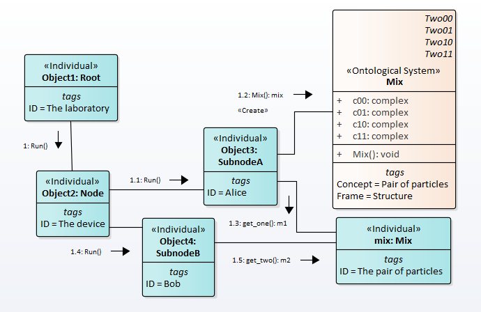

# Quantum Entanglement
<!---

-->
## 1. Mathematical description
We will not consider the EPR paradox, so we will consider quantum entanglement for only one property. Consider a quantum system having two particles. Each particle can be in two states: 0 and 1. In general, the wave function has the following form  
\begin{equation}
	|\psi\rangle = c_{00}|00\rangle   + c_{01}|01\rangle + c_{10}|10\rangle + c_{11}|11\rangle .
\end{equation}
If the particles are independent, then the wave function has the form  

\begin{eqnarray}
	|\psi\rangle = (c_0^1|0\rangle   + c_1^1|1\rangle)(c_0^2|0\rangle   + c_1^2|1\rangle) = \nonumber \\
	c_{00}|00\rangle   + c_{01}|01\rangle + c_{10}|10\rangle + c_{11}|11\rangle .
\end{eqnarray}  

If the system is in an entangled state, then its wave function will be as follows  

\begin{equation}
	|\psi\rangle = c_{00}|00\rangle   +  c_{11}|11\rangle
\end{equation}  
or  
\begin{equation}
	|\psi\rangle =  c_{01}|01\rangle + c_{10}|10\rangle .
\end{equation}  

## 2. Semantic Net Description
Let a point particle be in two basic states ZERO and ONE.  
``` python
class State(Enum):
        ZERO = 1
        ONE = 2

class Leaf0(Component): # <<Atom>>
    """ Concept = Particle in the base state 0 """
    def __init__(self):
        self.state = State.ZERO
class Leaf1(Component): # <<Atom>>
    """ Concept = Particle in the base state 1 """
    def __init__(self):
        self.state = State.ONE

```  
Then a quantum particle can be defined as follows
``` python
class MixOne(Leaf0, Leaf1):
    """ Concept = Quantum particle """
    w0 = (1.0/math.sqrt(2.0))*complex(math.cos(0.0), math.sin(0.0))
    w1 = (1.0/math.sqrt(2.0))*complex(math.cos(0.0), math.sin(0.0))
    
    def __init__(self):
        random.seed()
        p = self.w0.conjugate()*self.w0
        p = abs(self.w0.real)**2
        r = random.random()
        print (p,r)
        if r <= p.real:
            self.struc = Leaf0() 
        else:
            self.struc = Leaf1() 
```  
Here we have a name conflict ('state' attribute and 'Run' operation). We use multiple inheritance emulation. Let's introduce the 'struc' attribute to store the object-structure. The difference between emulation and true inheritance is that the 'state' attribute is not inherited by the 'MixOne' class, but is encapsulated in a object-structure.  


Let us now consider how a composite quantum object can be created.
Wave function as a frame net is depicted in the picture Fig.5


Fig.5. The entanglement wave function

The message exchange order will be as follows,Fig.6.

  
Fig.6. Sequence of messages  
  
The complete code is here [https://github.com/vgurianov/qm/software/entaglement.py](https://github.com/vgurianov/qm/blob/master/software/entaglement.py).
