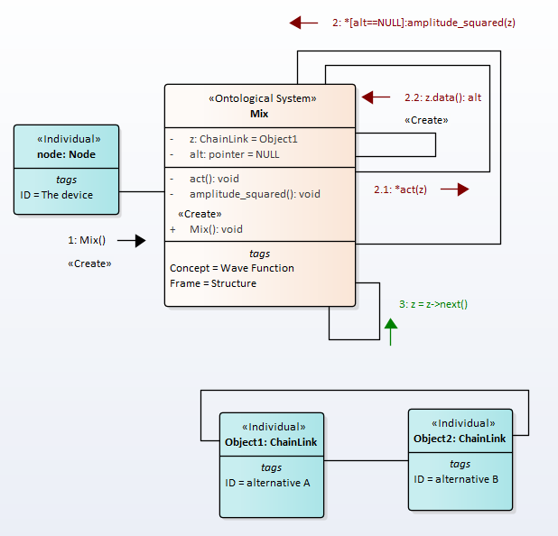
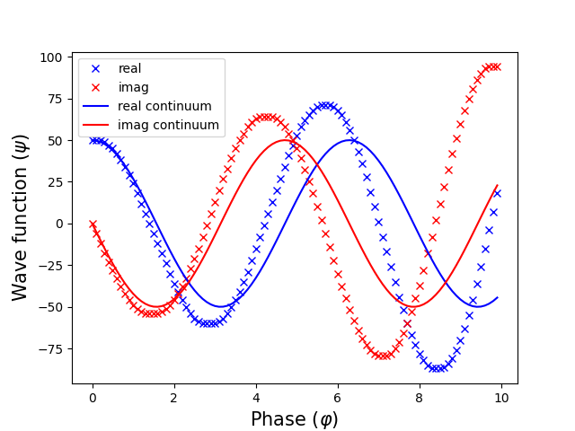
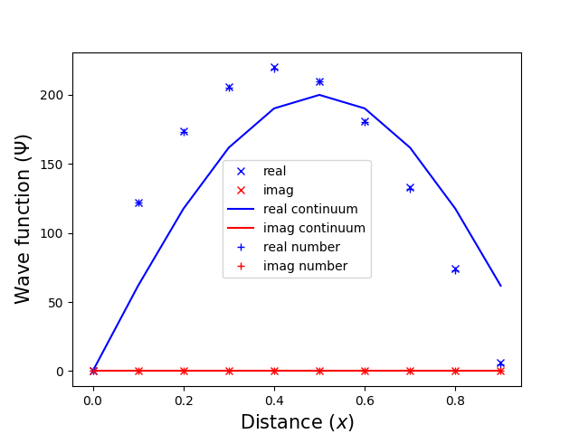

# Non-numerical model

## Introduction
In the previous sections, we have used complex numbers everywhere in models of quantum systems. Complex numbers can be eliminated by using the right data structures and processes.
Up to this section, we have used complex numbers to resolve name conflicts in multiple inheritance.
There are at least two reasons why you should get rid of complex numbers:
- it is difficult to accept the ontological nature of complex numbers
- complex numbers hinder the detailing of the model, as they require the use of formulas for calculating the amplitudes.  


The problem here is the following. The description of a scientific model in the language of semantic networks usually requires a higher level of detail than a mathematical model. This means that it is possible to build several data structures/processes that will be described by the same mathematical model. In turn, this means that it is necessary to formulate some new assumptions about the natural phenomenon.
The same applies to complex numbers.
There is a difficulty this the way. We can construct several data structures that will be described by the complex arithmetic. This means that it is necessary to put forward new hypotheses to substantiate quantum mechanics.  

As such a hypothesis, we will assume that the data structure should be as simple as possible. In what follows, we will everywhere use the following principle.  
We should choose data structures/processes that are as simple as possible. Extremely simple data structures/processes are data structures/proceses that can no longer be simplified. Note that from the point of view of the "strong anthropological principle" this may not be true.   

To exclude complex numbers from models, we will consider a looped dynamic list. We choose a looped list because this data structure remains invariant after the list has been traversed. A description of these data structures and operations on structures is given in [Appendix. Complex numbers](complex_numbers.html).

## 1. Hilbert space and name conflict resolution

To build a simulation of Hilbert space , let's take the ComplexNumber data structure described in the Appendix. Complex numbers. Let's add two more attributes to this structure: next and data.  
``` python
class ComplexNumber:
    def __init__(self, r, i):
        self.real = r
        self.imag = i

class ChainLink(ComplexNumber):
    def __init__(self, r, i):
        super().__init__(r, i)
        self.next = None
        self.data =None
```  

The data attribute will store a pointer to the corresponding class from the multiple inheritance set. The next attribute contains a pointer to the next element in the Hilbert space.  

The following message exchange protocol is proposed to resolve the name conflict according to the "quantum rule", Fig.1.

  
Fig.1. The wave function collapse simulation   

The diagram shows the following messaging process. After the constructor is called, the loop starts with the condition alt==NULL. In the loop, the procedure amplitude_squared(z, self.act) is called. The current object of class ComplexNumber is passed to the procedure. In the procedure amplitude_squared(z, self.act), the procedure act(z) is called. In this procedure, the constructor of the class z is called with some probability P. Probability P determines the time of quantum decoherence. If no alternative is chosen in one call to amplitude_squared(z), the list z is shifted and the process is repeated. At the end of this process, the alt attribute will be assigned a random alternative.  

We may implement it like this
``` python
def __init__(self):
    self.alt = None
    Done = True
    z = Mix.z
    while Done:
      amplitude_squared(z, self.act)
      if self.alt is not None:
          Done = False
          print(self.alt.s)
      z = z.next

```
and we may implement act(z) like this
``` python
def act(self, z):
    random.seed()
    r = random.random()
    P = 0.001
    if r < P:
        self.alt = z.data()
```
Note that in this procedure we can also get rid of the number P and random - function.
It can be replaced with the corresponding processes.
<!---
% https://en.wikipedia.org/wiki/Linear_congruential_generator
-->

Full code is the [https://github.com/vgurianov/qm/software/Schrödinger1.py](https://github.com/vgurianov/qm/blob/master/software/Schrödinger1.py).

## 2. Time-dependent Schrödinger equation

The time-dependent Schrödinger equation has form  

$$ i\hbar frac {d}{dt}  |\Psi (t)\rangle = \hat {H}|\Psi (t)\rangle  $$

where t is time, $$\vert \Psi (t)\rangle $$ is the state vector of the quantum system , and  $$\hat {H}$$ is a Hamiltonian operator.  
A time-dependent state vector $$|\Psi (t)\rangle $$  can be written as the linear combination  

$$\Psi (t)\rangle =\sum _{n}A_{n}e^-iE_{n}t/\hbar,$$  

where $$ A_{n} $$ are complex numbers and the vectors $$|\psi _{E_{n}}\rangle $$ are solutions of the time-independent equation $$ \hat {H}|\psi _{E_{n}} \rangle = E_{n}|\psi \rangle $$.  

The time-dependent finite difference Schrödinger equation will be  

$$ i\hbar frac {|\Psi (t_{i+1} - |\Psi (t_{i} )\rangle}{\Delta t}   = \hat {H}|\Psi (t_{i})\rangle $$  

From here we get a constant-recursive sequence  

$$  |\Psi (t_{i+1}) = \hat {C}|\Psi (t_{i} )\rangle}$$,  
here   
$$\hat {C} = 1 + frac {1}{i\hbar} \hat {H} \Delta t $$

The complex $$frac {1}{i\hbar}\hat {H}\Delta t $$ is dimensionless. Therefore, we write it in the following form  

$$\hat {C} = 1 - i \omega $$  

where $$\omega$$ is some integer number.
In simulation models, $$\Delta t = 1$$. It is an one tick of modeling time.  

We may implement it like this
``` python
@classmethod
def cls_run(cls):
    x1 = create_loop(1)
    x2 = create_loop(-1)  # -1, -2, ...
    c = ComplexNumber(x1,x2)
    z = cls.z1
    while True:
        z1 = cmultiplication(c, cls.z1)
        cls.real = z1.real
        cls.imag = z1.imag

        z = z.next
        if z == cls.z1:
            break
```  
Full code is the [Schrödinger1.py](Schrödinger1.py).  

Note that the system of processes can also be built on the basis of the modified Euler method, Rungi-Kutta, and etc.
The Schrödinger equation in real variables has the form  

$$ r_{k+1} = r_{k} + j_{k} \Delta t$$  
$$ j_{k+1} = j_{k} - \omega r_{k} \Delta t$$.  

The scalable model (*resolution* variable) can be written as
``` python
dr = dev(cls.z1.imag, resolution)
x1 = add(cls.z1.real, dr)
di = change_sign(cls.z1.real)
di = dev(di, resolution)
x2 = add(cls.z1.imag, di)
cls.z1.real = x1
cls.z1.imag = x2
```
Full code is the [Schrödinger4.py](Schrödinger4.py).  

  The unnormalized graph of the wave function is shown in Fig. 1 (*resolution* = 10, i.e. $\Delta t = 0.1$).

    
  Fig.2. Wave function versus time   


After a certain number of steps, the process loses stability. As the resolution increases, the region of instability goes to infinity.


## 3. Time-independent Schrödinger equation
% https://en.wikipedia.org/wiki/Schr%C3%B6dinger_equation
Time-independent Schrödinger equation has form  

$$ \hat {H} |\Psi \rangle =E|\Psi \rangle $$

where $$E$$ is the energy of the system.  

We will view the particle in a one-dimensional potential energy boxor (or infinite potential well). The time-independent Schrödinger equation may be written

$$ -\frac {\hbar ^{2}}{2m} \frac {d^{2}\psi}{dx^{2} = E\psi $$  

The general solutions of the Schrödinger equation for the particle in a box are

$$\psi (x)=Ae^{ikx}+Be^{-ikx} \qquad \qquad E=\frac {\hbar ^{2}k^{2}} {2m} $$  
or, from Euler's formula,  
$$\psi (x)=C\sin(kx)+D\cos(kx)$$,  
where $$D = 0$$ and
$$k=\frac {n\pi }{L}}\qquad \qquad n=1,2,3,\ldots$$ .  

We will use the ChainLink class. The Data attribute will contain a pointer to alternatives. Each alternative is a class that contains an instance of the physical space where the particle resides in a particular cell. The ChainLink classes must be ordered in the same way as the space itself.

In finite differences, the equation can be written as

$$ \Psi_{i+1} = 2\Psi_{i} -\omega \Psi_{i} \Delta x ^{2} -\Psi_{i-1} $$,  
here $$ omega = \frac {2mE}{\hbar ^{2}}$$.  

The scalable model (*resolution* variable) can be written as
``` python

while True:

  zz = cadd(z,z)
  dz = cdev(z,resolution*resolution)
  dz = cchange_sign(dz)
  zz = cadd(zz,dz)
  zl = cchange_sign(zlast)
  zz = cadd(zz,zl)  

  zlast = z
  z = z.next
  if z == cls.z1:
    break
```
Full code is the [Schrödinger5.py](Schrödinger5.py).  

  The unnormalized graph of the wave function is shown in Fig. 3 (*resolution* = 10, i.e. $\Delta x = 0.1$).

    
  Fig.3. Wave function versus distance   

For comparison, the figure also shows the results of calculations with complex numbers. We see that the simulation result exactly falls on the numerical data. However, unlike numerical simulation, this model represents some physical processes.
## Conclusion
