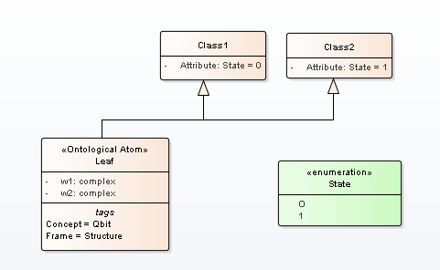

The mass-energy equivalence is described by the famous equation
$$ E=mc^2 $$
discovered in 1905 by Albert Einstein.  
In natural units ($$c = 1$$), the formula expresses the identity  

\begin{equation}
E=m
\end{equation}
Subscripts in math mode are written as $$a_b$$ and superscripts are written as $$a^b$$. These can be combined an nested to write expressions such as  

\begin{equation}
 T^{i_1 i_2 \dots i_p}{j_1 j_2 \dots j_q} = T(x^{i_1},\dots,x^{i_p},e_{j_1},\dots,e_{j_q})
\end{equation}  

We write integrals using $\int$ and fractions using $$\frac{a}{b}$$. Limits are placed on integrals using superscripts and subscripts:
\begin{equation}
\int_0^1 \frac{dx}{e^x} =  \frac{e-1}{e}
\end{equation}
Lower case Greek letters are written as $$\omega$$, $$\delta$$ etc. while upper case Greek letters are written as $$\Omega$$, $$\Delta$$.

Mathematical operators are prefixed with a backslash as $$\sin(\beta), \cos(\alpha), \log(x)$$ etc.

A quantum superposition of the "basis states"  
\begin{equation}
 |\psi\rangle = c_1|0\rangle   + c_2|1\rangle ,
\end{equation}
here $$|0\rangle$$ and $$|1\rangle$$ are the Dirac notation for the quantum state that will always give the result 0 or 1 when make a measurement.

Figure 1: A general structure UML2 SP  
----

Figure 1: A general structure UML2 SP  
  
  
  
  Experiment result is depicted in table 2
   
	№ | $AB$ | $BC$  |  $AC$ |$N[A^+,B^+]$ | $N[B^-,C^-]+N[A^+,C^+]$ 
	- | ---- | ------| ------ |-------- |  -------
	1 | 240° | 60° | 300° | 15 | 11  
	2 | 240° | 60° | 300° | 15 | 11  
 
