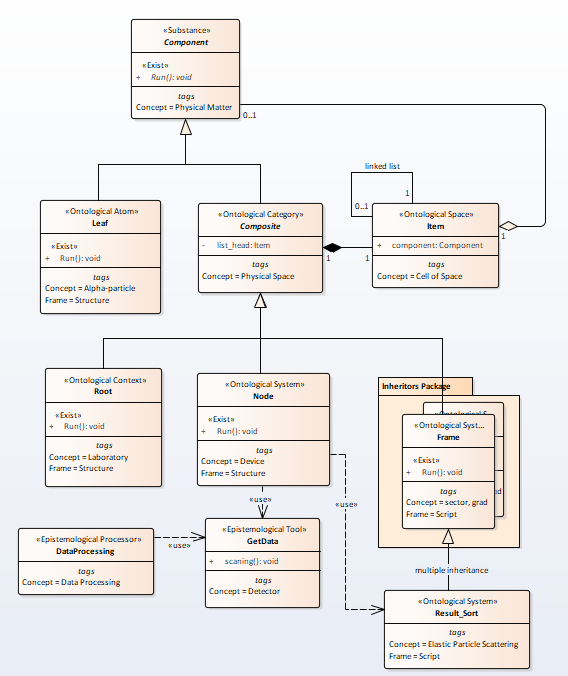
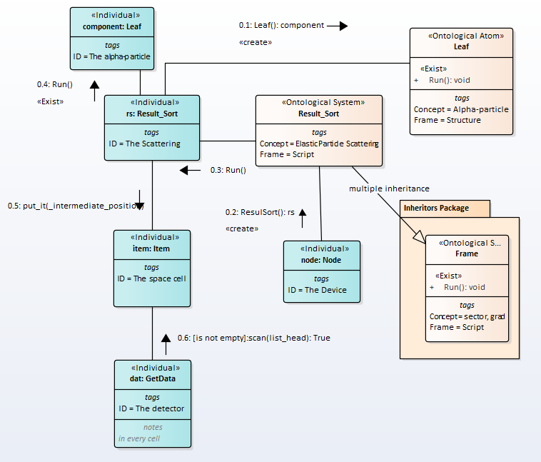
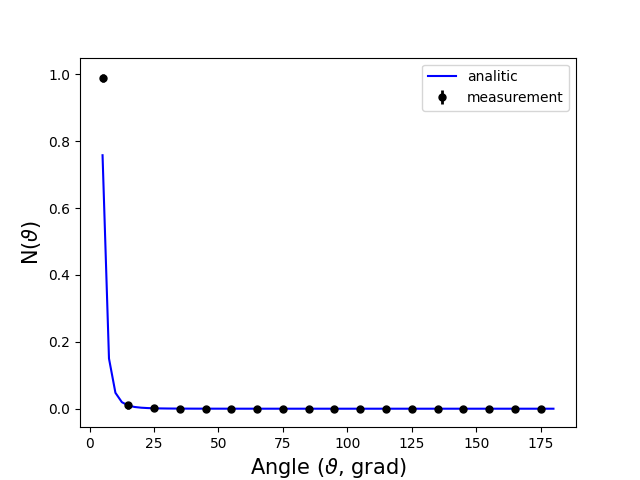

# Rutherford scattering I. Quantum model.
<!---
% https://en.wikipedia.org/wiki/Rutherford_scattering
% Blohincev1976ru.djvu, p.331 
-->

## 1. Mathematical description
 

Let us consider the scattering of alpha particles by heavy metal atoms.  
The scattering amplitude of fast charged particles on atoms is determined by the formula

\begin{equation}
A(\theta)=-\frac{ee_1}{2\mu v^2} \left\{Z-F(\theta ) \right\}cosec^2\frac{\theta }{2},
\end{equation}  
here  
$$F(\theta)$$ is atomic factor, $$e$$ is electron charge,$$e_1$$ is an alpha-particle charge, $$\mu$$ is mass of an alpha-particle, $$v$$ is velocity alpha-particle.  
Atomic factor for an atom with radius $$a$$ is  

\begin{equation}
F(\theta)=\frac{Z}{\left(1+K^2a^2 \right)^2}
\end{equation}  
The differential scattering cross section is  
\begin{equation}
\sigma \left(\theta  \right) = \frac{e_1^2e^2Z^2}{4\mu^2v^4}\left(1-\frac{1}{1+4k^2a^2sin^2\frac{\theta }{2}} \right)^2cosec^4\frac{\theta }{2}
\end{equation}  
If $$ka\gg1$$ (fast particle) then we get the Rutherford formula  

\begin{equation}
\sigma \left(\theta  \right) = \frac{e_1^2e^2Z^2}{4\mu^2v^4}cosec^4\frac{\theta }{2}
\end{equation}  
This formula coincides with the formula for elastic scattering of charged particles in the Coulomb field of a nucleus.  
For alpha-particles, we get ($$e_1 = 2e$$)  

\begin{equation}
\sigma \left(\theta  \right) = \frac{e^4Z^2}{\mu^2v^4}cosec^4\frac{\theta }{2}
\end{equation}  

## 2. Semantic Net Description  

For scattering, an ontology is depicted in the picture Fig.1

Fig.1. The ontology of the scattering  

The message exchange order will be as follows,Fig.6.

  
Fig.2. Sequence of messages    

## 3. Experiments result
Typical result of the experiment is depicted in Fig.3 (kn = 10 measurements for each value $$\varphi$$).  

Figure 3 - Experiment result    
