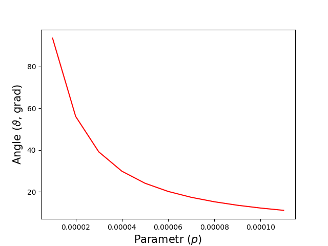
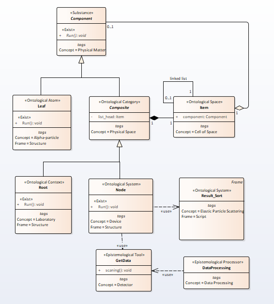
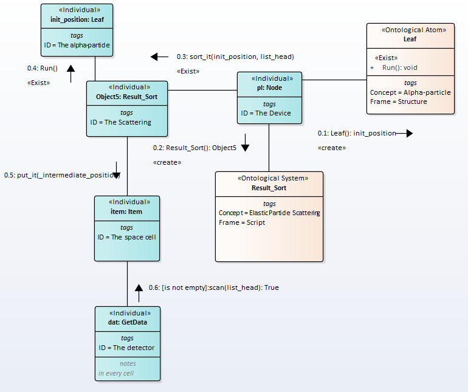
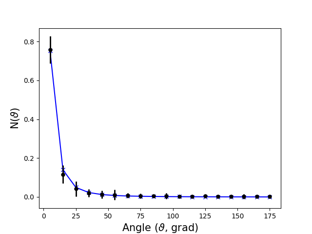

# Rutherford scattering II. Classical case and comparison

## 1. Mathematical description
% Charles Kittel, Walter D.Knight, Malvin A. Ruderman, Mechanics. Berkeley physics course. Vol.1, McGraw-Hill book company. 1965, formula (1), p.470  

The deflection angle $\theta$ of the particle is  
\begin{equation}  
\tan^{-1}\frac{\theta }{2}=\frac{2p}{b},  
\end{equation}  
where p is the impact parameter, b is the stopping distance and  
\begin{equation}
  b=\frac{2NeQ}{mu^2}
\end{equation},  
where Ne is the charge of the atom, m is the mass, u is the velocity, Q is the charge of the alpha particle.  
The dependence of the scattering angle $\theta$ on the impact parameter $p$ is shown in fig.1.   

Fig.1. The $\theta(p)$ dependence   

## 2. Semantic Net Description  

For scattering, an ontology is depicted in the picture Fig.1

Fig.1. The ontology of the scattering  

The message exchange order will be as follows,Fig.6.

  
Fig.2. Sequence of messages    

Typical result of the experiment is depicted in Fig.3 (kn = 10 measurements for each value $$\varphi$$).  

Figure 3 - Experiment result

## 3. Classical and quantum models comparison
Comparing the diagrams, two main differences can be noted:
1. The frame in the quantum case is the result of multiple inheritance
2. In the quantum case, the operation "Exist" is called from the constructor  

We also note the following.
The space is modeled the same way.
The particle becomes classical only at the moment it hits the counter.
