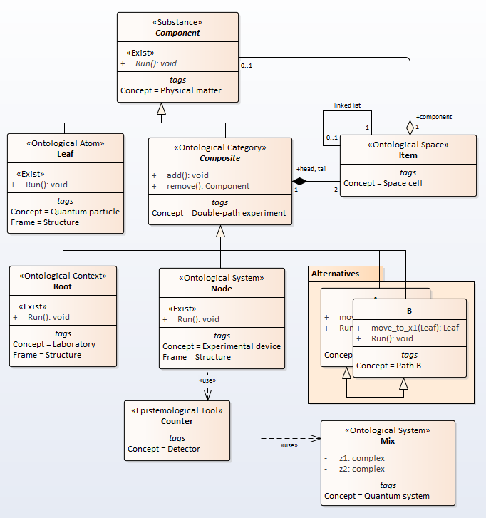
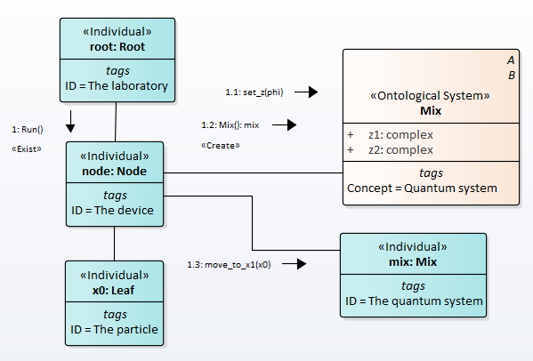
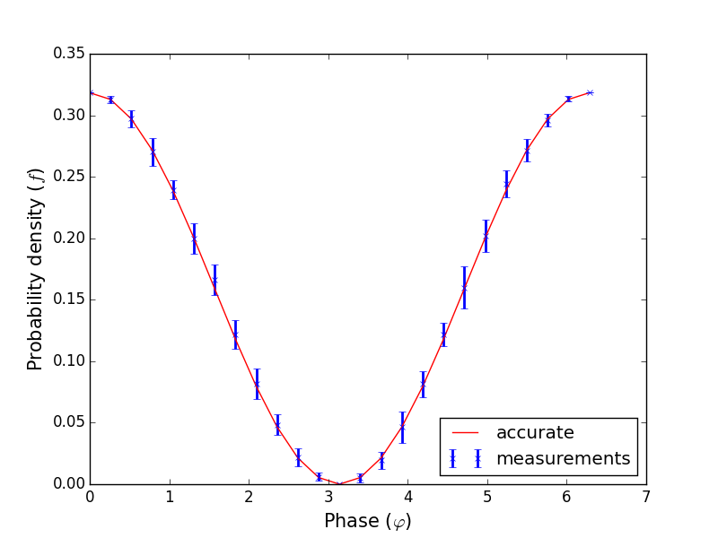
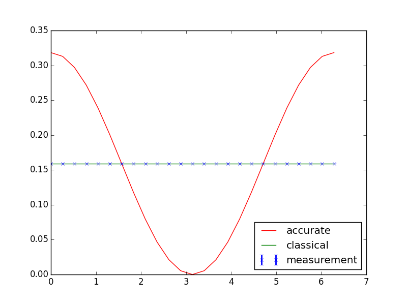

# Double-Slit Experiment  
<!---
terms
https://en.wikipedia.org/wiki/Double-slit_experiment
https://en.wikipedia.org/wiki/Quantum_superposition
-->
The double-slit experiment is a demonstration that light and matter can display characteristics of both classically defined waves and particles. In 1927, Davisson and Germer demonstrated that electrons show the same behavior.

## 1. Matematical description
Let the particle get from the source $$x_{0}$$ to the point of the screen $$x_{1}$$ by two paths a and b.  
Then the transition is described by the wave function

$$|\psi\rangle = A_{a}|a\rangle + A_{b}|b\rangle ,$$

here $$A_{a}=c_{a}e^{i \varphi_{a}}$$, $$A_{b}=c_{b}e^{i \varphi_{b}}$$ are a complex numbers and $$c_{a}$$, $$c_{b}$$ are a real numbers.  
The probability density of detecting a particle at the point $$x_{1}$$ is determined by the formula

\begin{equation}
\langle\psi|\psi\rangle = \mid A_{a}\mid ^{2} + \mid A_{b}\mid ^{2} + (A_{a}^* A_{b}+A_{a}A_{b}^*) =\\  
c_{a}^2 + c_{b}^2 + 2c_{a}c_{b}\cos(\varphi_{a}-\varphi_{b})
\end{equation}

The integral of the absolute squares of the amplitudes is one:

\begin{equation}
\int_0^{2\pi} \langle\psi|\psi\rangle d\varphi = 1, \\  
\end{equation}  
where $$\varphi = \varphi_{a}-\varphi_{b}$$.  
Then  
\begin{equation}  
2\pi c_{a}^2 + 2\pi c_{b}^2 + 2c_{a}c_{b}[\sin(2\pi)-\sin(0)] =  \\  
2\pi (c_{a}^2 + c_{b}^2) = 1. \\  
\end{equation}  
If $$c_{a} = c_{b} = c$$ then
$$\begin{align*}
c = \pm \frac{1}{2\sqrt\pi}
\end{align*}$$.


## 2. Semantic net description
The UML2 SP language is designed to develop simulation models according to the SSP (Use-Case, Analysis, and Design Models) methodology, which is an adapted version of the Unified Process.
An analysis model is a conceptual domain model. In SSP, the conceptual model is an ontology.
To build the ontology of the problem domain, the principle of decomposition is used. In fact, this means applying the "Composite" design pattern by GoF. Note that in the SSP methodology, not only the structure, but also the activity is subjected to decomposition.  
The semantic net is built from frames. Each frame has three tagged values: Concept, FrameType, Category. By default Frame=Structure, Category=Ontology. Tagged value Concept must be assigned. 
All frames are labeled with stereotypes. Frame attributes and operations are also marked with stereotypes and the tagged value Concept.

An ontology of the double-slit experiment is depicted in Fig.1


Figure 1 - The ontology of the experiment  

Let us give a brief description of the ontology concepts.  

#### Physical matter
The 'Component' frame with the stereotype <<Substance>> defines the most general properties of all elements of the model. In this case, the 'Run' operation is defined. This operation has a stereotype <<Exist>>, which determines the course of model time.  

#### Quantum particle
A frame with <<Atom>> stereotype defines an atomic (indivisible) object. This element has much in common with ABS agents, but there are also differences. In this case, it is a point particle.  

#### Double-path experiment and Space Cell
The 'Composite' frame define abstract "Double-path experiment" concept. A frame with <<Category>> stereotype defines an abstract aggregate (composite object). A frame defines a container for atomic objects and subsystems. The frame defines the operations of adding and deleting objects. In this model, a linked list is used to store objects, the list is specified by the head and tail of the list. This list models a one-dimensional physical space and is inherited by concrete classes, with each class getting its own instance of the space.  
In this case, the 'add' and 'remove' operations looks like
``` python
    def add(self, c):
        self.head = c
    def remove(self):
        c = self.tail
        self.tail = None
        return c
```

#### Laboratory
A frame with <<Context>> stereotype defines an boundary and initial conditions for the system under study. In fact, the experimental device is in relation to the composition with the context, although formally this is not the case.  

  
#### Experimental device
The "Node" frame define concrete double-slit experiment. Operation 'Run' describes the full cycle of the experiment. A single impulse is moved to a separate one_tick procedure, in fact, all the physics is collected here. The code looks like  
  
``` python 
def one_tick(self): 
  self.head.component = Leaf() # create particle
  self.tail.component = None   # clear detector
  self.head.right.component = Mix()   # name conflict resolved
  if self.head.right.component.funс is not None:
    # jump to point x1
    self.tail.component = self.head.right.component.funс.move_to_x1(self.head.component) 
```  
It is worth noting that in this case, a description is given of the sequence of events connected by cause-and-effect relationships. But these events are in no way ordered in time. The first three lines can be swapped, but the if block cannot be swapped.  
  
One step of the experiment is depicted in Fig.2.  

Figure 2 - Single experiment  
  

The particle created and put to 'x0' point. 'node' (experimental device) send 'set_z(phi)' message to 'Mix' class wich set both 'z1' and 'z2' attributes. Further, 'node' create an 'mix' object, where resolve the names conflict. Next step is execute 'move_to_x1' operation that put the particle to 'x1' point on screen.
This process execute in 'Run' operation many times for get statistics.  
We observe that here has  elements metaprogramming.  

#### Quantum system
The 'Mix' class has only one task - to resolve the name conflict. The class inhered 'move_to_x1' operation from both 'A' and 'B' classes. In this case, we has conflict of the names. This conflict resolve as the quantom rule. The 'Mix' class has 'z1' and 'z2' attributes for the quantom rule.  
To do this, we use multiple inheritance emulation. Let's introduce the func attribute to store the object-function.
The emulation itself is performed as follows  
``` python
def __init__(self):
  # Names conflict resolution
  self.funс = None  # one of the alternatives
  w = self.z1 + self.z2
  d = abs(w)**2
  p = d.real /(4.0*c**2)
  r = random.random()
  if r<p:
    rr = random.choice([0,1])
    if rr == 0:
      self.funс = A()  # inherits the operation from A
    else:
      self.funс = B()  # inherits the operation from B
  else:
    self.func = None
```  
  
The difference between emulation and true inheritance is that the 'move_to_x1' operation and the space model are not inherited by the Mix class, but are encapsulated in a function object. However, this does not affect the quality of the simulation.
  
#### Alternatives
Classes 'A' and 'B' define an operation with the same name, 'move_to_x1'. This operation implements the movement of the particle from the source to the screen. Implementation will be as follows
``` python
def move_to_x1(self, p):
  self.add(p)
  self.Run()
  return self.remove()
```  
          
The implementation of the Run operation will be as follow
``` python
def Run(self): # <<Exist>>
  """ Concept = particle displacement B """
  self.tail = self.head
```  
  
## 3. Classical model
The classical model assumes the scattering of classical particles by two slits. To do this, instead of alternatives and the Mix class, we use the 'OneClass' class, which has two operations with different names 'move_to_x1' and 'move_to_x2'. 
The ontology is a similar an ontology of quantum case but has  'OneClass' class.  
Let's consider how space and time are described within the ontology.
#### Space 
The space is modeled by a linked list, each specific class has its own space, i.e. belongs to the namespace of the corresponding class. We postulate that 'head' and 'tail' are public attributes. Then the space of this model can be perceived as something integral. When moving from system to subsystem and vice versa, the scaling effect will appear. The mathematical model of this construction is the Euclidean space.   
Space in quantum mechanics seems to be arranged in exactly the same way.  
#### Time 
In UML SP, concurrent threads are associated with objects of classes. One of the concurrent programming patterns is used. Simple examples are Single Threaded Execution and Producer-Consumer patterns. The time counter is set as a global variable. Each thread is given the opportunity to execute a portion of the Run code. The meter reading will display the generally accepted mathematical model of time.  
Perhaps for a quantum system one should postulate the atomic nature of the Run procedure.  
  
Newtonian space and time should be viewed more as an epistemological entity, since they are used solely for measurements.  

## 4. Experiments result
Simulation should be considered as the terminal stage of inference in frame networks.
Typical result of the experiment is depicted in Fig.3 (kn = 10 measurements for each value $$\varphi$$).

Figure 3 - Experiment result  

Classical case is depicted in Fig.4. Classical experiment hasn't 'Mix' class and probabilite is a sum square amplitudes.  

Figure 4 - Classical experiment result  

Same  result can be get if 'A' and 'B' classes has different name of the operations (for instance, 'move_to_x1' and 'move_to_x2').  

## 5. Software
The complete code is here [https://github.com/vgurianov/qm/software/slits.py](https://github.com/vgurianov/qm/blob/master/software/slits.py).  

Both classes A and B describe a paths from $$x_{0}$$ to $$x_{1}$$.  
The 'Mix' class describe wave function $$|\psi\rangle$$. The function has 'wa' and 'wb' atributes. It are coeficents of the wave function. In the function '__init__' operation resolve the conflict names 'move_to_x1'.  
The 'Node' class simulate a experimental device.  
  

