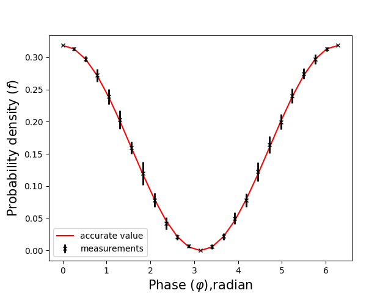

# Double-Slit Experiment  
<!---
https://en.wikipedia.org/wiki/Double-slit_experiment
https://en.wikipedia.org/wiki/Quantum_superposition
-->
The double-slit experiment is a demonstration that light and matter can display characteristics of both classically defined waves and particles. In 1927, Davisson and Germer demonstrated that electrons show the same behavior.

## 1. Matematical description
Let the particle get from the source $$x_{0}$$ to the point of the screen $$x_{1}$$ by two paths a and b.  
Then the transition is described by the vron function

$$|\psi\rangle = A_{a}|a\rangle + A_{b}|b\rangle ,$$

here $$A_{a}=c_{a}e^{i \varphi_{a}}$$, $$A_{b}=c_{b}e^{i \varphi_{b}}$$ are a complex numbers and $$c_{a}$$, $$c_{b}$$ are a real numbers.  
The probability density of detecting a particle at the point $$x_{1}$$ is determined by the formula

\begin{equation}
\langle\psi|\psi\rangle = \mid A_{a}\mid ^{2} + \mid A_{b}\mid ^{2} + (A_{a}^* A_{b}+A_{a}A_{b}^*) =\\  
c_{a}^2 + c_{b}^2 + 2c_{a}c_{b}\cos(\varphi_{a}-\varphi_{b})
\end{equation}

The integral of the absolute squares of the amplitudes is one:

\begin{equation}
\int_0^{2\pi} \langle\psi|\psi\rangle d\varphi = 1, \\  
\end{equation}  
where $$\varphi = \varphi_{a}-\varphi_{b}$$.  
Then  
\begin{equation}  
2\pi c_{a}^2 + 2\pi c_{b}^2 + 2c_{a}c_{b}[\sin(2\pi)-\sin(0)] =  \\  
2\pi (c_{a}^2 + c_{b}^2) = 1. \\  
\end{equation}  
If $$c_{a} = c_{b} = c$$ then
$$\begin{align*}
c = \pm \frac{1}{2\sqrt\pi}
\end{align*}$$.

## 2. Semantic net description
The UML2 SP language is designed to develop simulation models according to the SSP (Use-Case, Analysis, and Design Models) methodology, which is an adapted version of the Unified Process.
An analysis model is a conceptual domain model. In SSP, the conceptual model is an ontology.
To build the ontology of the problem domain, the principle of decomposition is used. In fact, this means applying the "Composite" design pattern by GoF. Note that in the SSP methodology, not only the structure, but also the activity is subjected to decomposition.  
The semantic net is built from frames. Each frame has three tagged values: Concept, FrameType, Category. By default Frame=Structure, Category=Ontology. Tagged value Concept must be assigned. 
All frames are labeled with stereotypes. Frame attributes and operations are also marked with stereotypes and the tagged value Concept.

An ontology of the double-slit experiment is depicted in Fig.1

Figure 1 - The ontology of the experiment  

### Component frame
The frame with the stereotype <<Substance>> defines the most general properties of all elements of the model. In this case, the Run operation is defined. This operation has a stereotype <<Exist>>, which determines the course of model time.  

### Leaf frame
A frame with <<Atom>> stereotype defines an atomic (indivisible) object. This element has much in common with ABS agents, but there are also differences. In this case, it is a point particle.  
  
  
The ontology is a similar an ontology of classical case but has  'Mix' class. The class inhered 'move_to_x1' operation from both 'A' and 'B' classes. In this case, we has conflict of the names. This conflict resolve as the quantom rule. The 'Mix' class has 'w1' and 'w2' attributes for the quantom rule.  
The 'Composite' frame define abstract 'Doble-path experiment' concept. The 'Node' frame define concrete experiment and determine the installation construction.  

One step of the experiment is depicted in Fig.2.  

Figure 2 - Single experiment  

The particle created and put to 'x0' point. Object2 (experimental install) send 'set_w(phi)' message to 'Mix' class wich set both 'w1' and 'w2' attributes. Further, Object2 create an 'a' object, where resolve the names conflict. Next step is execute 'move_to_x1' operation that put the particle to 'x1' point on screen.
This process execute in 'Run' operation many times for get statistics.  
We wach that here has  elements metaprogramming.  

## 3. Experiments result
Typical result of the experiment is depicted in Fig.3 (kn = 10 measurements for each value $$\varphi$$).

Figure 3 - Experiment result  

Classical case is depicted in Fig.4. Classical experiment hasn't 'Mix' class and probabilite is a sum square amplitudes.  

Figure 4 - Classical experiment result  

Same  result can be get if 'A' and 'B' classes has different name of the operations (for instance, move_to_x1 and move_to_x2).  

## 4. Software
The complete code is here [https://github.com/vgurianov/qm/software/slits.py](https://github.com/vgurianov/qm/blob/master/software/slits.py).  

Both classes A and B describe a paths from $$x_{0}$$ to $$x_{1}$$.  
The 'Mix' class describe wave function $$|\psi\rangle$$. The function has 'wa' and 'wb' atributes. It are coeficents of the wave function. In the function '__init__' operation resolve the conflict names 'move_to_x1'.  
The 'Node' class simulate a experimental device.  
  

