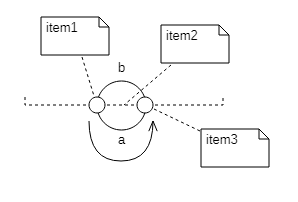
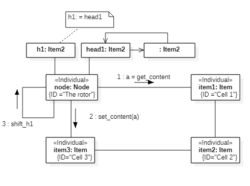
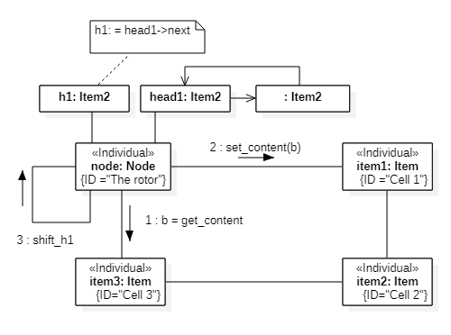
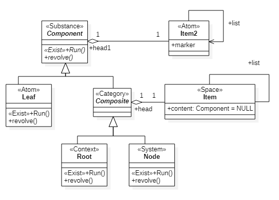
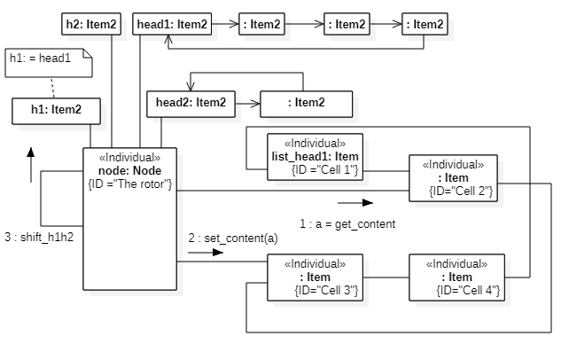
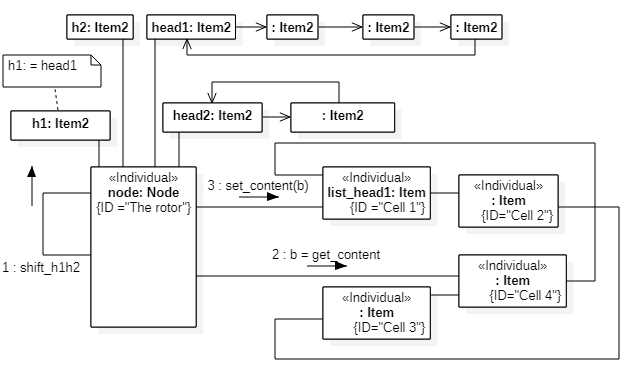
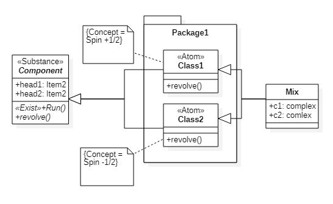

# Spin
<!---
% https://en.wikipedia.org/wiki/Spin_(physics)
% https://en.wikipedia.org/wiki/Spin-1/2
-->
## 1. Mathematical description
The orbital angular momentum operator is the quantum-mechanical counterpart to the classical angular momentum of orbital revolution.
Spin is other type of angular momentum in quantum mechanics.  

Spin can be defined in terms of the spatial rotation group. The formula looks like  

$$\alpha = 360°/s$$,  

where $$\alpha$$ is the angle of turn, s is the spin.

A spin-zero particle can only have a single quantum state, even after torque is applied. A spin-0 particle can be imagined as sphere, which looks the same after whatever angle it is turned through.

Rotating a spin-2 particle 180° can bring it back to the same quantum state. The spin-2 particle can be analogous to a straight stick that looks the same even after it is rotated 180°.
A spin-4 particle should be rotated 90° to bring it back to the same quantum state.

Mathematically, quantum-mechanical spin states are described by vector-like objects known as spinors. There are subtle differences between the behavior of spinors and vectors under coordinate rotations.

For example, rotating a spin-1/2 particle by 360° does not bring it back to the same quantum state, but to the state with the opposite quantum phase. To return the particle to its exact original state, one needs a 720° rotation. (The Plate trick and Möbius strip give non-quantum analogies.)  

## 2. Semantic Net Description  

Consider first the classical case of rotation. We model the space as a circle list  of n space  cells (bidirectional). The motion of a point particle along this ring simulates a rotational motion along the circle. One selected cell will be used to model the center of rotation. Let the circle lie in the x,y-plane, centered at O. The angular momentum vector will be directed to Z if the rotation is counterclockwise, and counter-Z if the rotation is clockwise.  

If all cells contain particle then this design transforms into itself when rotated through 360°/(n-1). Note that n is the resolution of the model but the symmetry of the mechanical system should not depend on n, i.e. symmetry determined disposition of particles.   

To control the movement of a point particle, we use a unidirectional closed list *head1* of n-1 elements. The angular momentum is proportional to this list in absolute value.  
In pseudocode, this can be written as  
``` python
h1 = self.head1
while True:
        a = self.list_head.component
        self.list_head.component = self.list_head.right.component
        self.list_head = self.list_head.right
        self.list_head.component = a
        if not h1.marker:
            break
        h1 = h1.next

```
This algorithm works both for one particle and for k(-0...n particles. For rotation in the opposite direction, it is necessary to use *left* instead *right*.

Consider the limiting case when n= 2.

Let the space be represented by three cells (*item1, item2, item3*). Let's place a point particle in *item1*, *item2* is the axis of rotation. The particle moves from cell *item1* through *a* to cell *item3*, Fig.1.  

  
Fig.1. The turn  

For s=1, two steps are required, Fig.2,3.   

  
Fig.2. First step  

  
Fig.3. Second step  

In pseudocode, this can be written as  
``` python
def revolve(self, d):
    # d is direction of rotation (-1,1)

    h1 = self.head1
    while True:
        if d == 1:
            a = self.list_head.component
            b = self.list_tail.component
        else:
            b = self.list_head.component
            a = self.list_tail.component

        self.list_head.component = None
        self.list_tail.component = None

        if d == 1:
            self.list_tail.component = a
            self.list_head.component = b
        else:
            self.list_tail.component = b
            self.list_head.component = a

        if not h1.marker:
            break
        h1 = h1.next

```  
Let us assume that the spin for a point particle can be written in the following form  
``` python
def revolve(self, d):

    h1 = self.head1
    while True:
        if d == 1:
            pass
        else:
            pass

        if d == 1:
            pass
        else:
            pass

        if not h1.marker:
            break
        h1 = h1.next
```  
Then the ontology will look like Fig.3  

  
Fig.3. Ontological description of spin  

In the quantum case, the *Leaf* and *Node* classes are replaced by wave functions.  
The complete code is here [https://github.com/vgurianov/qm/software/spin-classic.py](https://github.com/vgurianov/qm/blob/master/software/spin-classic.py). 

## 2. Spin 1/2
Let us consider the rotation of a point particle over the surface of a Möbius strip. This will require four steps. The two steps are shown in Figures 4 and 5.

  
Fig.3. Second step  
  
Fig.3. Fourth step  

In pseudocode, this can be written as  
``` python
h1 = self.head1
h2 = self.head2
lh = self.list_head1
while True:
    if lh.top:
        a= lh.component
        lh.component = None
        lh = lh.right
        lh.component = a
    else:
        b= lh.component
        lh.component = None
        lh = lh.right
        lh.component = b

    if not h1.marker:
        break
    h1 = h1.next
    h2 = h2.next

```  
Let us assume that the spin for a point particle can be written in the following form  
``` python  
def revolve(self):
    h1 = self.head1
    h2 = self.head2
    while True:
        if not h1.marker:
            break
    h1 = h1.next
    h2 = h2.next
```  
Then the semantic net description will look like Fig.5  

  
Fig.5. Semantic net description of spin 1/2  


