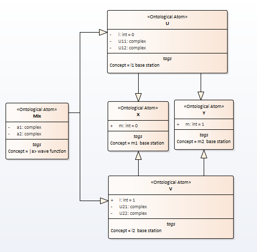

# Uncertainty principle
## 1. Matematical discription
Let $$\hat {L}$$ and $\hat {M}$ be  self-adjoint operators and their commutator $[{\hat {L}},{\hat {M}}]={\hat {L}}{\hat {M}}-{\hat {M}}{\hat {L}}$ be non-zero. Denote by $\mid l_i\rangle$ and $\mid m_j\rangle$, $i,j=1,2$ the eigenfunctions of these operators.

Let wave function $\mid a\rangle$ be determined in $$l$$-basis

\begin{equation}
	|a\rangle = a_1|l_1\rangle   + a_2|l_2\rangle
              = \langle l_1|a\rangle |l_1\rangle   + \langle l_2|a\rangle |l_2\rangle
\end{equation}  
Both $m$- and $l$-basis can be transform into each other.

\begin{eqnarray}
	\mid l_1\rangle = \langle m_1 \mid l_1\rangle \mid m_1\rangle   + \langle m_2 \mid l_1\rangle \mid m_2\rangle \nonumber \\
	  	\mid l_2\rangle = \langle m_1\mid l_2\rangle \mid m_1\rangle   + \langle m_2\mid l_2\rangle \mid m_2\rangle
\end{eqnarray}

Now we can to transform $|a\rangle$ wave function to $m$-basis.

\begin{multline}
	|a\rangle   =  a_1 |l_1\rangle   + a_2 |l_2\rangle = \nonumber\\
	  =  a_1 (\langle m_1 \mid l_1\rangle \mid m_1\rangle   + \langle m_2 \mid l_1\rangle \mid m_2\rangle )   +
	a_2 ( \langle m_1\mid l_2\rangle \mid m_1\rangle   + \langle m_2\mid l_2\rangle \mid m_2\rangle ) = \nonumber \\
	= (a_1 \langle m_1 \mid l_1\rangle + a_2  \langle m_1\mid l_2\rangle)\mid m_1\rangle +
	(a_1 \langle m_2 \mid l_1\rangle + a_2  \langle m_2\mid l_2\rangle)\mid m_2\rangle = \nonumber \\
	= b_1 \mid m_1\rangle + b_2 \mid m_2\rangle ,
\end{multline}  

where  

\begin{eqnarray}
b_1 = a_1 \langle m_1 \mid l_1\rangle + a_2  \langle m_1\mid l_2\rangle \nonumber \\  
b_2 = a_1 \langle m_2 \mid l_1\rangle + a_2  \langle m_2\mid l_2\rangle
\end{eqnarray}  

i.e. $$ b = Ua $$, where $$U$$ is a unitary operator and $$a^+=(a_1,a_2)$$, $$b^+=(b_1,b_2)$$.

% https://en.wikipedia.org/wiki/Unitary_operator
A unitary operator satisfies $$U^*U = UU^* = I$$, where $$U^*$$ is the adjoint of $$U$$, and $$I$$ is the identity operator. Suppose that the unitary operator has form

$$
U =
\begin{pmatrix}
	1/\sqrt{2} & 1/{\sqrt{2}}  \\
	1/\sqrt{2} & -1/\sqrt{2}
\end{pmatrix}
$$  
then we get uncertainty principle.
Let be $$a_1 = 1, a_2 = 0$$. From (7) we get $$b_1 = 1/\sqrt{2}$$ and $$b_2=1/\sqrt{2}$$. Let be $$a_1 = 1/\sqrt{2}, a_2 = 1/\sqrt{2}$$ then we get $$b_1 = 1$$ and $$b_2=0$$.

As we can see, if the measurement of one quantity is accurate, then the other quantity is completely uncertain.

## 2. Semantic Net Description
Wave function as a semantic net is depicted in the picture  

Fig.4. The uncertainty principle wave function  

The name conflict (l and m) is resolved twice. First in the constructor of classes U and V, then in the constructor of the MIX class.

## 3. Software and results

Experiment result is depicted in table

| №   | $$\mid m_1\rangle$$   |$$\mid m_2\rangle$$  | $$\mid l_1\rangle$$   | $$\mid l_2\rangle$$ |
| --- | ---- | --- | ---- | :----------: |
| 1   | 1.0 | 0.0 | 0.497 | 0.503         |
| 2   | 0.499 | 0.501 | 1.0 | 0.0         |
